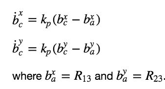
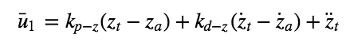

# The C++ Project Write Up #
    
#### Project Requirement:
1. Cloned the repository and gotten familiar with the C++ environment as outlined in C++ Setup.    
  
2. Complete each of the scenarios outlined in the C++ project readme. This will involve implementing and tuning   controllers incrementally:
 - Body rate and roll/pitch control (scenario 2)
 - Position/velocity and yaw angle control (scenario 3)
 - Non-idealities and robustness (scenario 4)   
 
3. Tune controller and make sure it works to successfully meet each of the evaluations in each scenario.    

The architecture of the  drone controller consists of altitude controller, position controller, and attitude controller like folowing:
    

#### Parameter Tuning (scenario 1)
In scenario 1, I modified the quad mass in `QuadControlParams.txt` line [12](./config/QuadControlParams.txt#L12) 

[](https://www.youtube.com/watch?v=oNuX0w8yZDE)   
    
As the scenario pass you'll see:
```
PASS: ABS(Quad.PosFollowErr) was less than 0.500000 for at least 0.800000 seconds
Program ended with exit code: 0
```
### Body rate and roll/pitch control (scenario 2) ###   

The attitude controller breaks down into smaller controllers responsible for roll-pitch, yaw, and body rate like below:


 In scenario 2, I see a quad above the origin. It is created with a small initial rotation speed about its roll axis. Controller will need to stabilize the rotational motion and bring the vehicle back to level attitude.
Here are the steps to complete this scenario:   

1. Implement body rate control

 - implemented the code in the function `GenerateMotorCommands().`The code is in `QuadControl.cpp` line [56 to 96](/src/QuadControl.cpp#L56-L96) 
 
 - implemented the code in the function `BodyRateControl()` base on following equation:
 
 
 
 The code is in `QuadControl.cpp` line [98 to 122](/src/QuadControl.cpp#L98-L122) 
 
 - Tune `kpPQR` in `QuadControlParams.txt` to kpPQR = `30, 30, 5` to get the vehicle to stop spinning quickly but not overshoot.

 The rotation of the vehicle about roll (omega.x) get controlled to 0 while other rates remain zero. Note that the vehicle will keep flying off quite quickly, since the angle is not yet being controlled back to 0.  Also note that some overshoot will happen due to motor dynamics!

2. Implement roll / pitch control   

No need to worrying about yaw just yet.

 - implemented the code in the function `RollPitchControl()` as following equation. 
 
    
 
 
 
 The code is in `QuadControl.cpp` line [125 to 166](/src/QuadControl.cpp#L125-L166)  
 - Tune `kpBank` in `QuadControlParams.txt` to minimize settling time but avoid too much overshoot.

[](https://www.youtube.com/watch?v=ZAcTQpNt_sg)
    
As the scenario pass you'll see:
```
Simulation #11 (../config/2_AttitudeControl.txt)
PASS: ABS(Quad.Roll) was less than 0.025000 for at least 0.750000 seconds
PASS: ABS(Quad.Omega.X) was less than 2.500000 for at least 0.750000 seconds
```
### Position/velocity and yaw angle control (scenario 3) ###
    
  - `LateralPositionControl()` is a PID controller. The code is in `QuadControl.cpp` line [207 to 251](/src/QuadControl.cpp#L207-L251).   
  
  - `AltitudeControl()` is a PD controller base on following:   
  
    

    

    

    

The code is in `QuadControl.cpp` line [168 to 204](/src/QuadControl.cpp#L168-L204).
  - `YawControl()` Control over yaw decoupled from the other directions. A P controller is used to control the  drone's yaw. The code is in in `QuadControl.cpp` line [254 to 273](/src/QuadControl.cpp#L254-L273). 

[](./images/yaw_control.png)   

  - tune parameters kpPosZ and kpPosZ
  - tune parameters kpVelXY and kpVelZ
  
After tuning angle rate gains `kpPQR = 50, 50, 10` successful pass scenario 3 & 4

[](https://www.youtube.com/watch?v=RRuN89Ynjrk)
    
As the scenario pass you'll see:
```
Simulation #18 (../config/3_PositionControl.txt)
PASS: ABS(Quad1.Pos.X) was less than 0.100000 for at least 1.250000 seconds
PASS: ABS(Quad2.Pos.X) was less than 0.100000 for at least 1.250000 seconds
PASS: ABS(Quad2.Yaw) was less than 0.100000 for at least 1.000000 seconds
```
### Non-idealities and robustness (scenario 4) ###
    
 - The green quad has its center of mass shifted back
 - The orange vehicle is an ideal quad
 - The red vehicle is heavier than usual
 - Edit `AltitudeControl()` to add basic integral control to help with the different-mass vehicle.The code is in `QuadControl.cpp` line [168 to 204](/src/QuadControl.cpp#L168-L204)

In here suddenly need to tune all parameter all over again after tuning angle rate gains `kpPQR = 50, 50, 10` successful pass scenario 3 & 4

[](https://www.youtube.com/watch?v=7zBqXAWNi4E)     

As the scenario pass you'll see:
```
Simulation #4 (../config/4_Nonidealities.txt)
PASS: ABS(Quad1.PosFollowErr) was less than 0.100000 for at least 1.500000 seconds
PASS: ABS(Quad2.PosFollowErr) was less than 0.100000 for at least 1.500000 seconds
PASS: ABS(Quad3.PosFollowErr) was less than 0.100000 for at least 1.500000 seconds
```
### Tracking trajectories ###   

In this part you should see two drones follow trajectory part but after uning angle rate gains `kpPQR = 50, 50, 10` successful pass scenario 5.   

[](https://www.youtube.com/watch?v=eetnNu0gJfg)
    
As the scenario pass you'll see:
```
Simulation #3 (../config/5_TrajectoryFollow.txt)
PASS: ABS(Quad2.PosFollowErr) was less than 0.250000 for at least 3.000000 seconds
```
